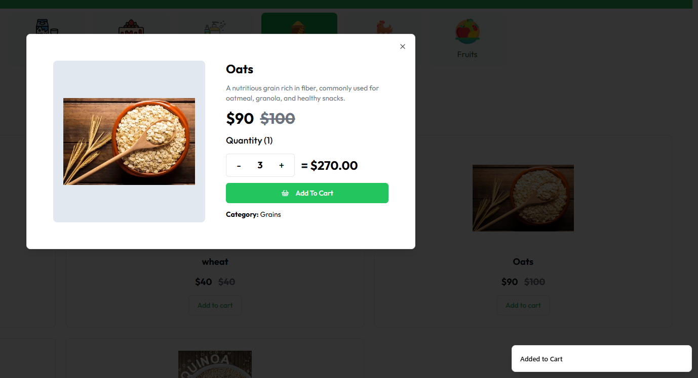
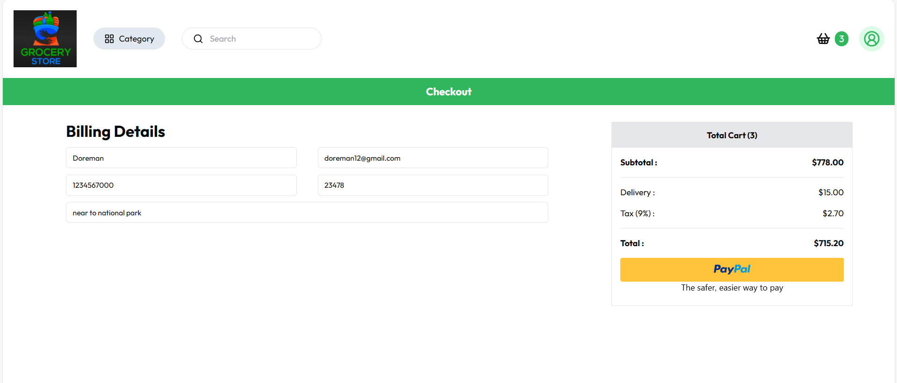
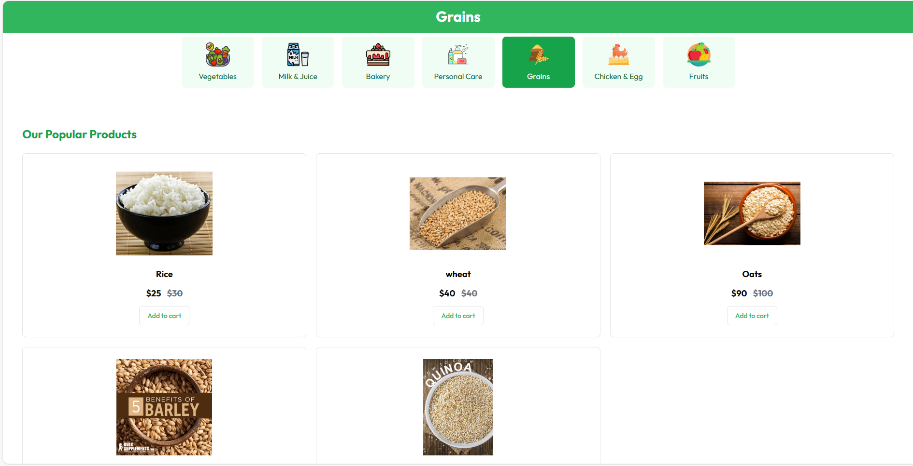
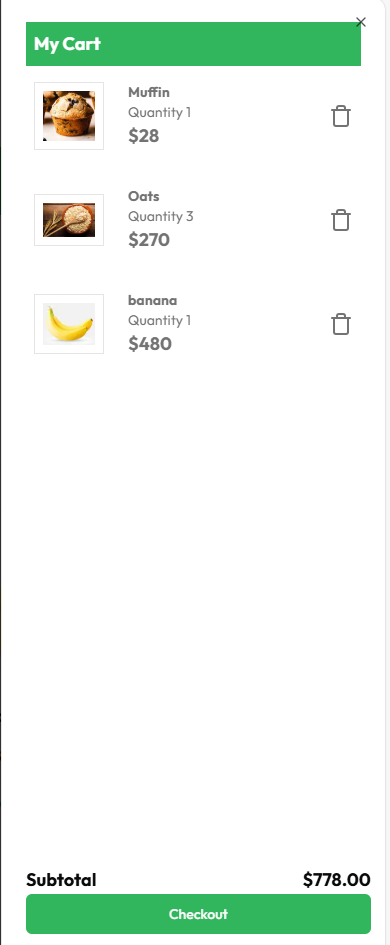
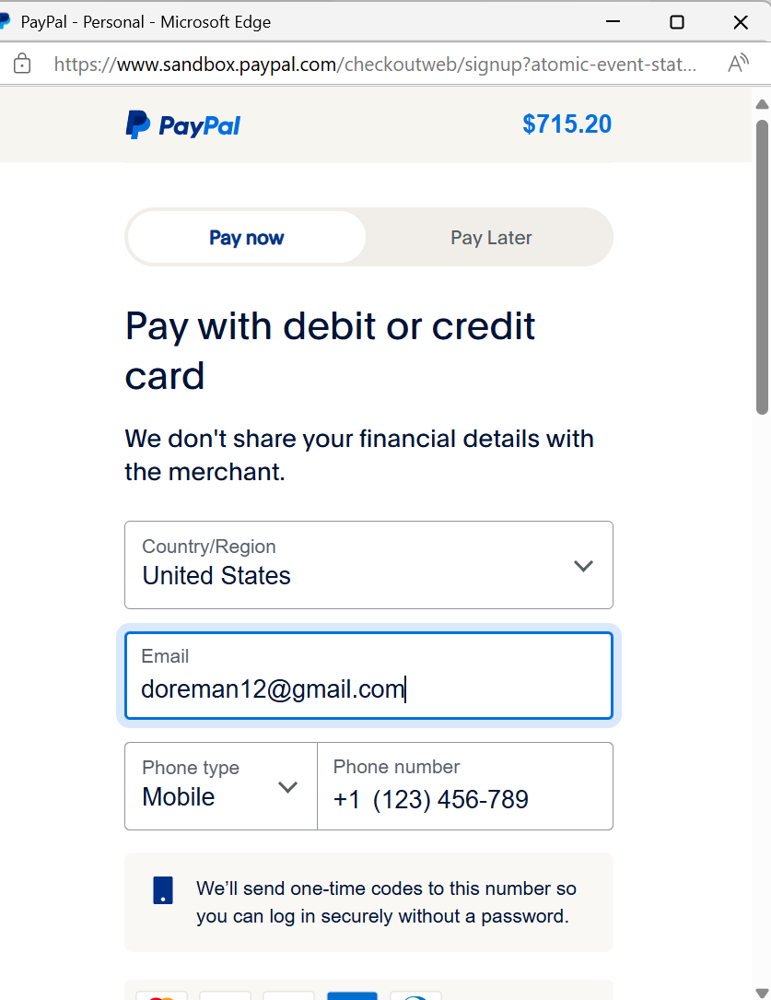
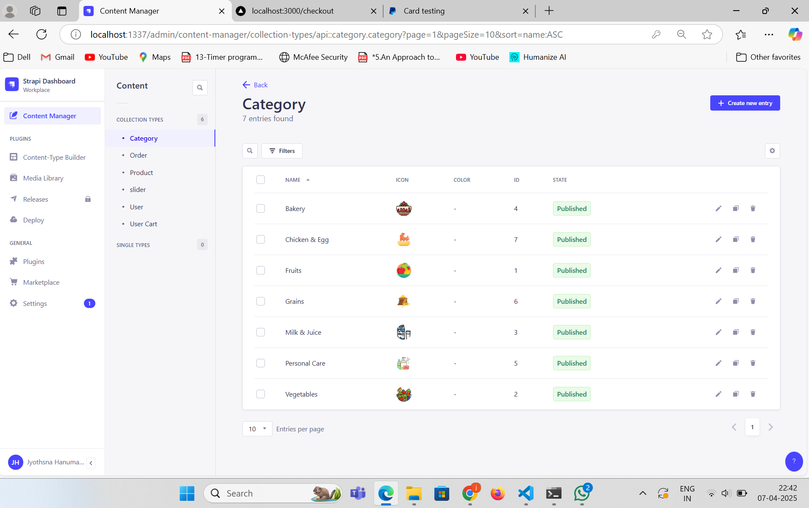
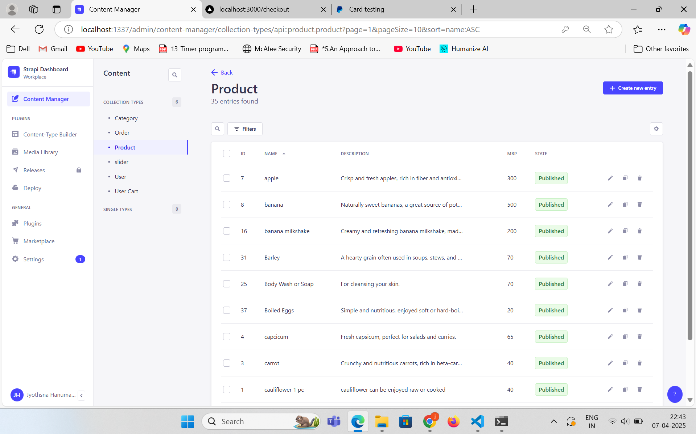
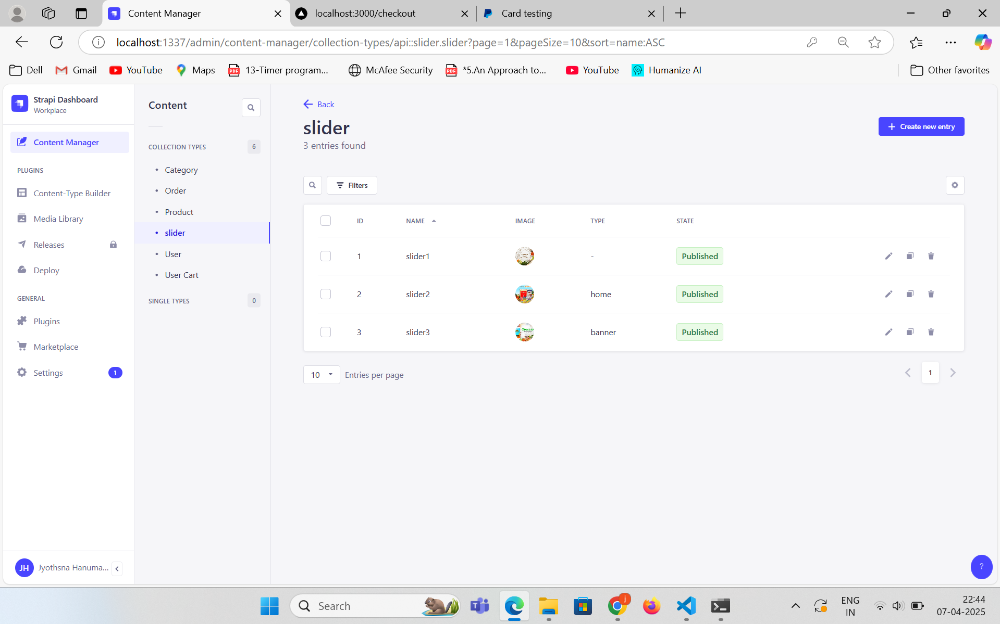
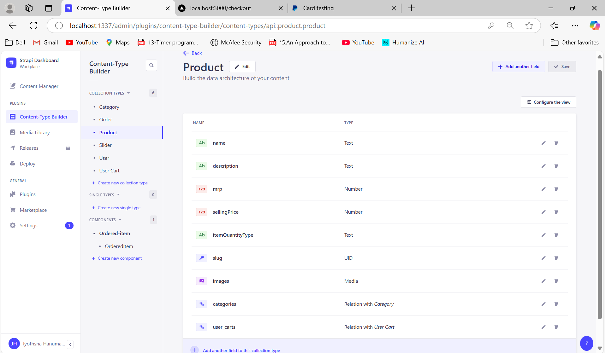

#  Grocery Developer App

A full-stack, modern online grocery shopping experience built using **Next.js**, **Strapi**, and **PostgreSQL**.

---

## Features

-  User Authentication (Sign In / Sign Up)
-  Add to Cart, Update Quantity, and Checkout
-  Filter and view products by category
-  Order confirmation and order history
-  Toast notifications using Sonner
-  Fully responsive UI using Tailwind CSS + ShadCN

---

## Tech Stack

| Frontend      | Backend       | Database    |
|---------------|---------------|-------------|
| Next.js 14+   | Strapi (Node) | PostgreSQL  |
| Tailwind CSS  | REST API      | Supabase (optional) |
| ShadCN UI     | JWT Auth      |             |

---

##  Folder Structure

online-grocery-store/ ├── app/ # All Next.js app routes & pages ├── components/ # UI components ├── public/ # Static assets (images, etc.) ├── .env.local # Local environment variables ├── README.md # Project info and usage └── ...
###  Frontend Setup

npm install
npm run dev
###  Backend Setup
cd backend
npm install
npm run develop
Your CMS will run at: http://localhost:1337

--> Backend can be seen in render
-->frontend would be deployed in vercel
## 📸 Screenshots

### Home Page

### Cart Page

### checkout Page

### grains in category Page

### subtotal Page

### payment Page

### category backend

### order backend

### product backend

### slider backend

### product_contentType

